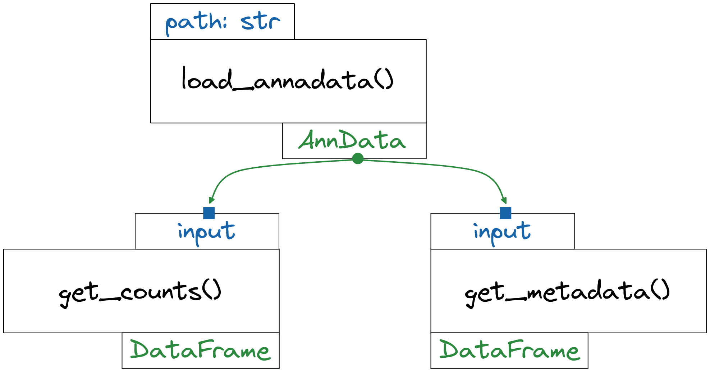

Dagster blablabla ...
Single cell blablabla ... data pipeline
Dagster would be extremely relevant for local development of analytic pipeline in the field
here we are going to through an example blablabla

## Load the data with python only

I am not going to contextualize the data here. Just know that the single cell sequencing data come from cancer cells that were subjected to different treatments. The sequencing data was mapped against the human genome and saved as `h5ad` files. It is a file format that stores AnnData object, the fundamental building block of the Scanpy library. We are going to use Scanpy to read this object.

If we had to do it using classical python code we could propose the following:

```python
import scanpy as sc
import pandas as pd


def get_count_matrix_from_h5ad(path: str) -> pd.DataFrame:
    """Extract the count matrix from an anndata object"""
    anndata = sc.read_h5ad(path)
    return anndata.to_df()


def get_metadata_from_h5ad(path: str) -> pd.DataFrame:
    """Extract the metadata from an anndata object present in `anndata.obs`"""
    anndata = sc.read_h5ad(path)
    return anndata.obs


if __name__ == "__main__":
    PATH = "data/raw/h5ad/RGR/KJF_RGR.h5ad"
    print(
        get_count_matrix_from_h5ad(PATH),
        get_metadata_from_h5ad(PATH)
    )
```

Now we could just execute our code:

```
python path/to/load.py
```

to get the following output:

```bash
                           0    1    2    3    4    5    6         7    8    9   10   11  ...  20009  20010  20011  20012  20013  20014  20015  20016  20017  20018  20019  20020
hn017_X068_NT_HN017      0.0  0.0  0.0  0.0  0.0  0.0  0.0  0.000000  0.0  0.0  0.0  0.0  ...    0.0    0.0    0.0    0.0    0.0    0.0    0.0    0.0    0.0    0.0    0.0    0.0
hn017_X068_NT_HN017.1    0.0  0.0  0.0  0.0  0.0  0.0  0.0  0.000000  0.0  0.0  0.0  0.0  ...    0.0    0.0    0.0    0.0    0.0    0.0    0.0    0.0    0.0    0.0    0.0    0.0
hn017_X068_NT_HN017.2    0.0  0.0  0.0  0.0  0.0  0.0  0.0  0.000000  0.0  0.0  0.0  0.0  ...    0.0    0.0    0.0    0.0    0.0    0.0    0.0    0.0    0.0    0.0    0.0    0.0
hn017_X068_NT_HN017.3    0.0  0.0  0.0  0.0  0.0  0.0  0.0  0.000000  0.0  0.0  0.0  0.0  ...    0.0    0.0    0.0    0.0    0.0    0.0    0.0    0.0    0.0    0.0    0.0    0.0
hn017_X068_NT_HN017.4    0.0  0.0  0.0  0.0  0.0  0.0  0.0  0.000000  0.0  0.0  0.0  0.0  ...    0.0    0.0    0.0    0.0    0.0    0.0    0.0    0.0    0.0    0.0    0.0    0.0
...                      ...  ...  ...  ...  ...  ...  ...       ...  ...  ...  ...  ...  ...    ...    ...    ...    ...    ...    ...    ...    ...    ...    ...    ...    ...
hn031_X158_PT_HN031.187  0.0  0.0  0.0  0.0  0.0  0.0  0.0  0.000000  0.0  0.0  0.0  0.0  ...    0.0    0.0    0.0    0.0    0.0    0.0    0.0    0.0    0.0    0.0    0.0    0.0
hn031_X158_PT_HN031.188  0.0  0.0  0.0  0.0  0.0  0.0  0.0  0.000000  0.0  0.0  0.0  0.0  ...    0.0    0.0    0.0    0.0    0.0    0.0    0.0    0.0    0.0    0.0    0.0    0.0
hn031_X158_PT_HN031.189  0.0  0.0  0.0  0.0  0.0  0.0  1.0  6.003666  0.0  0.0  0.0  0.0  ...    0.0    0.0    0.0    0.0    0.0    0.0    0.0    0.0    0.0    0.0    0.0    0.0
hn031_X158_PT_HN031.190  0.0  0.0  0.0  0.0  0.0  0.0  0.0  2.000244  0.0  1.0  0.0  0.0  ...    0.0    0.0    0.0    0.0    0.0    0.0    0.0    0.0    0.0    0.0    0.0    0.0
hn031_X158_PT_HN031.191  0.0  0.0  0.0  0.0  0.0  0.0  0.0  0.000000  0.0  0.0  0.0  0.0  ...    0.0    0.0    0.0    0.0    0.0    0.0    0.0    0.0    0.0    0.0    0.0    0.0

[3596 rows x 20021 columns]                         orig.ident    nCount_RNA  nFeature_RNA  batch sample treatment                 OG
hn017_X068_NT_HN017           X068    773.430000           477     68  HN017      SMCs      X068_NT_HN017
hn017_X068_NT_HN017.1         X068    438.140000           314     68  HN017      SMCs    X068_NT_HN017.1
hn017_X068_NT_HN017.2         X068    886.110000           498     68  HN017      SMCs    X068_NT_HN017.2
hn017_X068_NT_HN017.3         X068    402.250000           220     68  HN017      SMCs    X068_NT_HN017.3
hn017_X068_NT_HN017.4         X068    345.220000           217     68  HN017      SMCs    X068_NT_HN017.4
...                            ...           ...           ...    ...    ...       ...                ...
hn031_X158_PT_HN031.187       X158   9969.478365          2797    158  HN031      FMCs  X158_PT_HN031.187
hn031_X158_PT_HN031.188       X158  11465.470291          3289    158  HN031      FMCs  X158_PT_HN031.188
hn031_X158_PT_HN031.189       X158  25741.699607          4917    158  HN031      FMCs  X158_PT_HN031.189
hn031_X158_PT_HN031.190       X158  42022.885436          6369    158  HN031      FMCs  X158_PT_HN031.190
hn031_X158_PT_HN031.191       X158    998.665076           469    158  HN031      FMCs  X158_PT_HN031.191

[3596 rows x 7 columns]
```

The `print` statement was used as an example here. The idea behind a data engineering pipeline is to build a "*graph of functions that ingest and produce data assets*"<sup>1</sup>. So here the output generated by our two functions will be used as input data for subsequent processing and analytic tasks that remain to be defined.

We can refactor our code to make it more modular.

```python
import scprep as sp
import scanpy as sc
import pandas as pd


def load_anndata(path: str) -> sc.AnnData:
    """Load an AnnData object from a h5ad file"""
    return sc.read_h5ad(path)


def get_counts(anndata: sc.AnnData) -> pd.DataFrame:
    """Return a count matrix from an AnnData object"""
    return anndata.to_df()


def get_metadata(anndata: sc.AnnData) -> pd.DataFrame:
    """Return the metadata from an AnnData object"""
    return anndata.obs


if __name__ == "__main__":
    PATH = "data/raw/h5ad/RGR/KJF_RGR.h5ad"
    anndata = load_anndata(PATH)
    print(
        get_counts(anndata=anndata),
        get_metadata(anndata=anndata)
    )
```

We extracted the logic implemented to load the AnnData object in its own function, `load_anndata`. Its returned value feeds the other two functions `get_counts` & `get_metadata` that respectively return pandas DataFrame for the counts and metadata. If we had to depict the data flow as a graph we would have the following:



A couple of remark at this step:

- The path is hardcoded.
- We could implement a CLI application that parse the argument and get the path from there.
- We could save the path value in a `yaml` / `json` / `.env` and modify it based on our needs.
- Both imply to write extra code. But this is doable.
- As it is implemented now, we have no logs of our runs and no historicall records of the different runs if any.

## Load the data with python and dagster

Let's see how to translate this code to Dagster. We are going to approach this Top-Down. First the code and next we will elaborate on some concepts. Show me the code !

```python
from dagster import Output, op, Output, Out, job, fs_io_manager


import scanpy as sc
import pandas as pd


@op(config_schema={"path_to_h5ad": str}, out=Out(pd.DataFrame))
def load_anndata(context) -> sc.AnnData:
    return sc.read_h5ad(context.op_config["path_to_h5ad"])


@op(out=Out(pd.DataFrame))
def get_count_matrix_from_h5ad(context, anndata: sc.AnnData) -> pd.DataFrame:
    """Extract the count matrix from an anndata object"""
    counts = anndata.to_df()
    yield Output(
        counts,
        metadata={
            "whoiam": "Metadata from the RGR dataset",
            "# of cells": counts.shape[0],
            "# of genes": counts.shape[1]
        }
    )


@op(out=Out(pd.DataFrame))
def get_metadata_from_h5ad(context, anndata: sc.AnnData) -> pd.DataFrame:
    """Extract the metadata from an anndata object present in `anndata.obs`"""
    sc_metadata = anndata.obs
    yield Output(
        sc_metadata,
        metadata={
            "whoiam": "Metadata from the RGR dataset",
            "columns": str(sc_metadata.columns),
            "# of cells": sc_metadata.shape[0],
            "# of variables": sc_metadata.shape[1]
        }
    )


@job(resource_defs={"io_manager": fs_io_manager})
def from_anndata_to_pandas_job():
    """Load anndata and extract counts matrix and metadata"""
    anndata = load_anndata()
    get_count_matrix_from_h5ad(anndata)
    get_metadata_from_h5ad(anndata)
```
